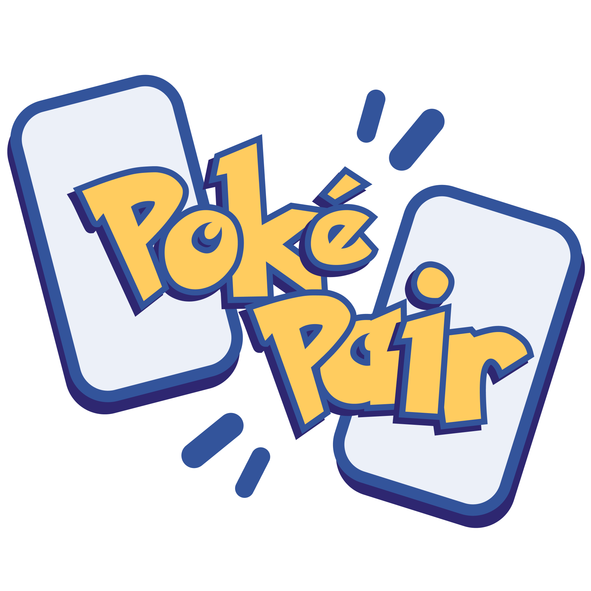
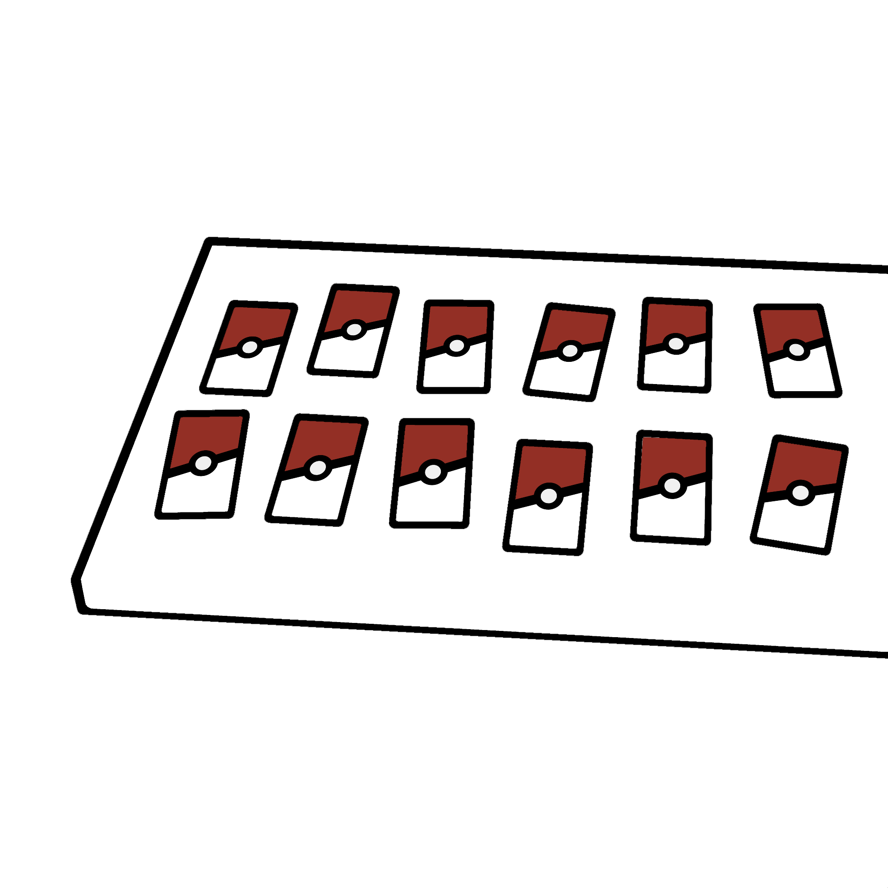
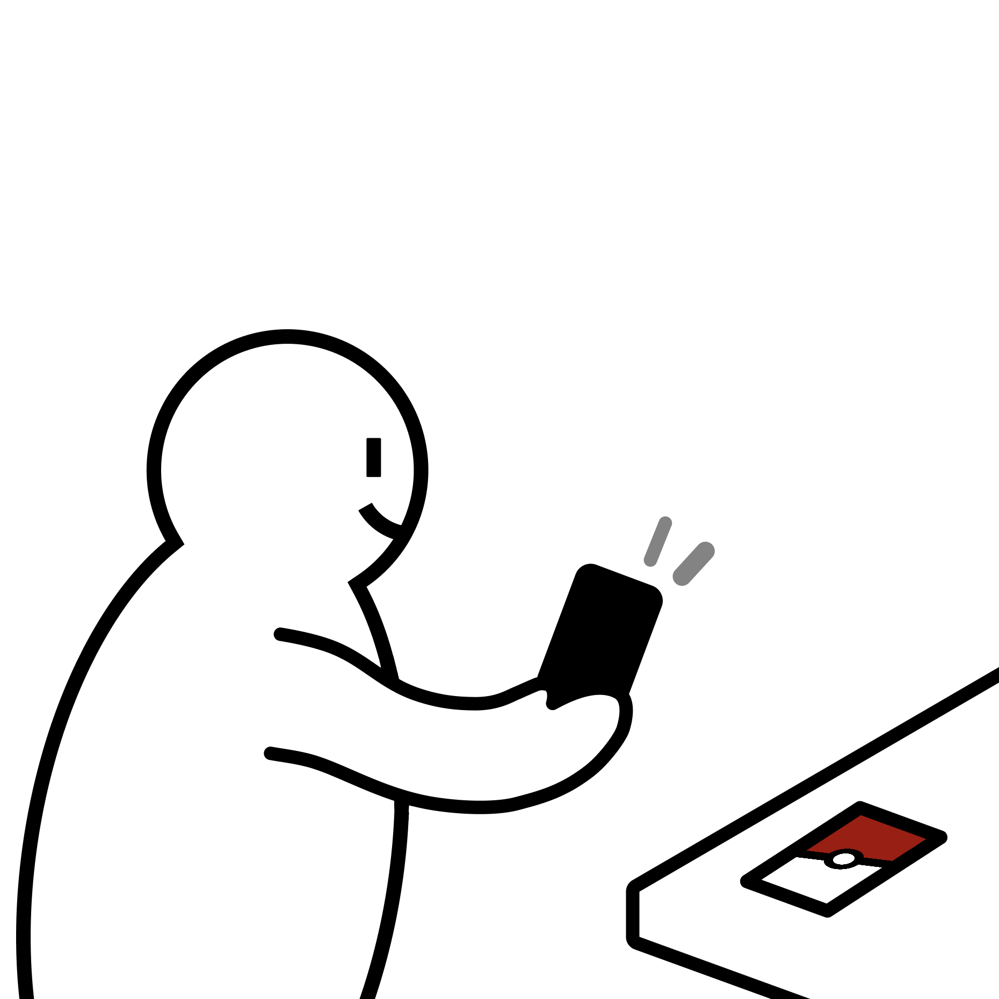
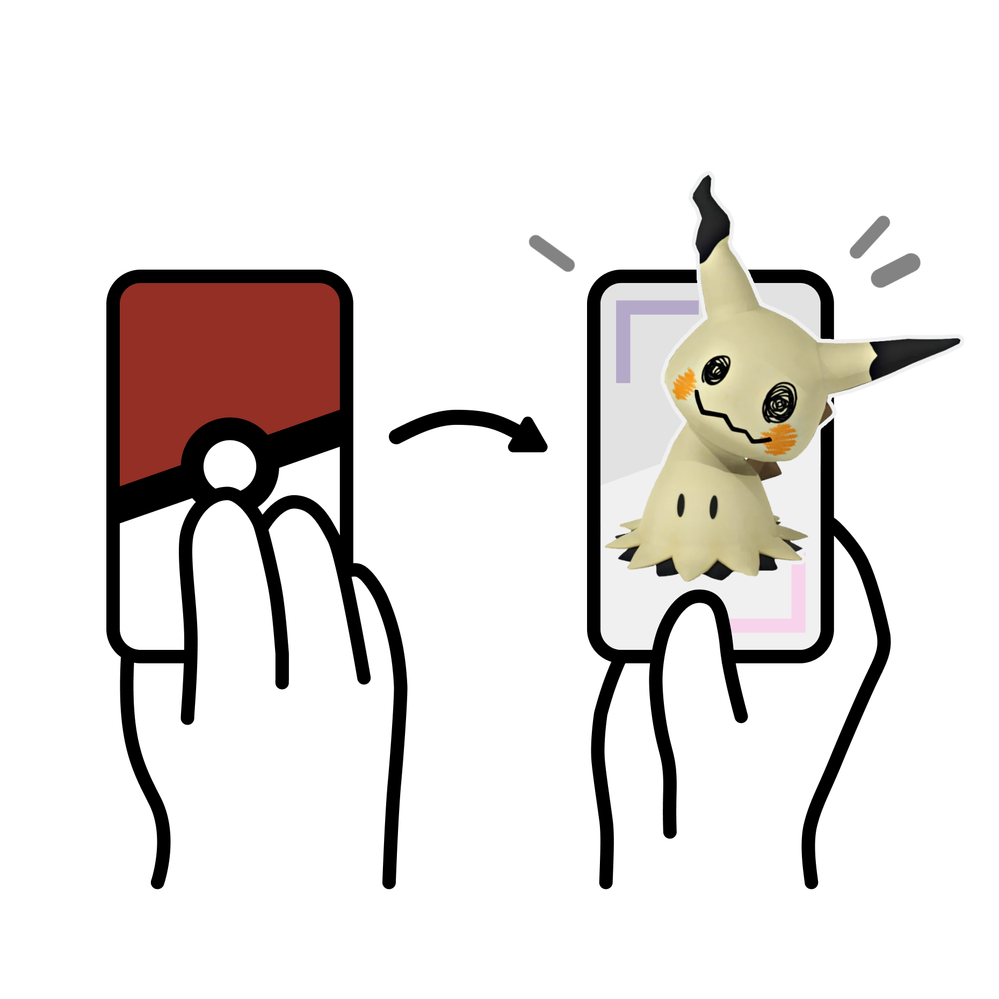
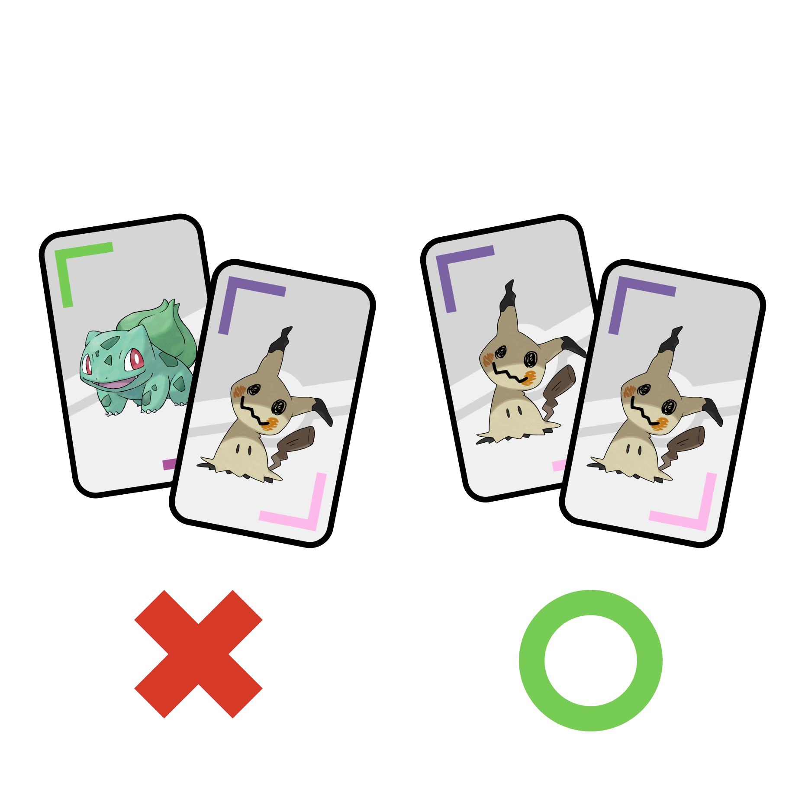
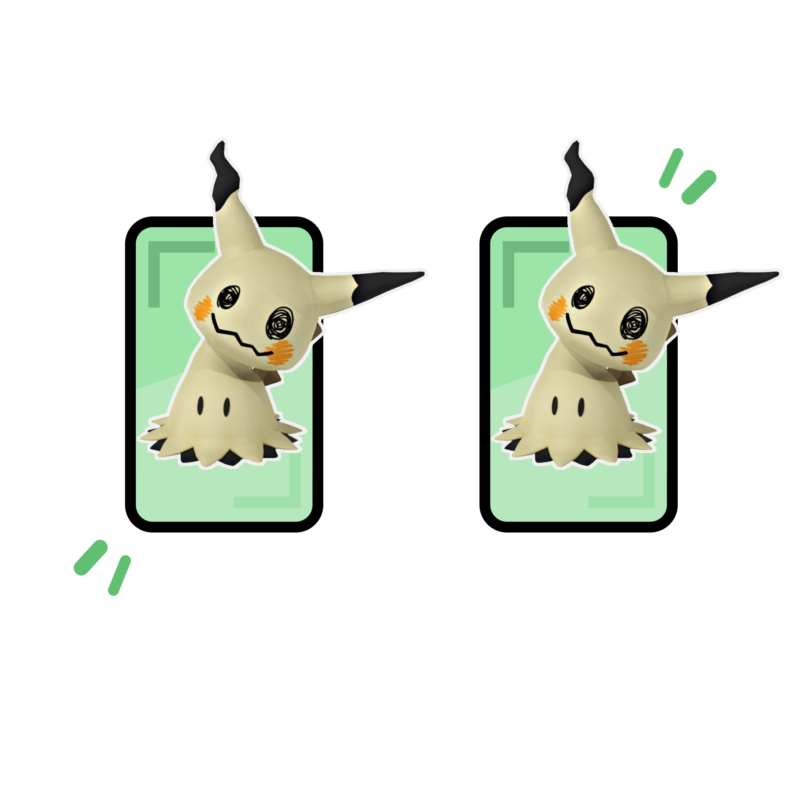
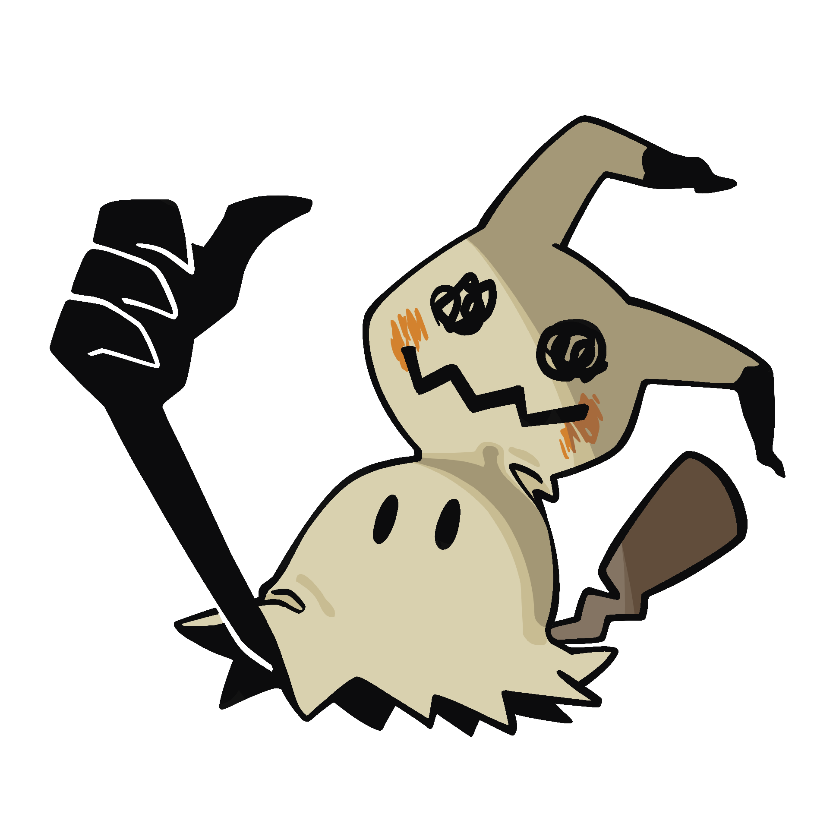

# PokéPair - Realitat Virtual i Augmentada

  

**GitHub project page**: [PokéPairAR](https://github.com/XXPabloS/Realitat-virtual-i-augmentada)

## Description
**PokéPair** is an AR Pokémon memory-matching game built with **Google ARCore** and Unity’s **AR Foundation** image tracking. The app recognizes Pokémon cards in real time and identifies matching pairs by detecting both the original and reversed versions of each Pokémon image.

## AR Foundation Features Used

     - Image Tracking

## Installation
**Unzip the [RELEASE FOLDER](https://github.com/XXPabloS/Realitat-virtual-i-augmentada/releases) and install the APK file on your Android device.**

## Controls

     - Move around - Move your device to focus the camera on the cards
     - Tap a card - Flip the card over
     
## How to Play

<table>
  <tr>
    <td width="30%">
      
    </td>
    <td>
      <b>1. Place your PokeCards</b> 
      Place your PokeCards on a flat surface, facing down.
    </td>
  </tr>

  <tr>
    <td width="30%">
      
    </td>
    <td>
      <b>2. Start the game</b> 
      Press <b>Start</b> on your Android device and focus the camera on your cards.
    </td>
  </tr>

  <tr>
    <td width="30%">
      
    </td>
    <td>
      <b>3. Flip a card</b> 
      Flip a card and see the Pokémon come alive!
    </td>
  </tr>

  <tr>
    <td width="30%">
      
    </td>
    <td>
      <b>4. Find the pairs</b> 
      Now you're all set! Let's find the matching pairs.
    </td>
  </tr>

  <tr>
    <td width="30%">
      
    </td>
    <td>
      <b>5. Match and score</b> 
      Correct pairs light up green and increase your score!
    </td>
  </tr>
</table>

  
   
  <strong>THAT'S ALL! HAVE FUN!</strong>

     
## Credits
**All contributors working on this project**:

_Pablo Sanjose_ « **Github**: [XXPabloS](https://github.com/XXPabloS)

_Ana Alcaraz_ « **Github**: [Audra0000](https://github.com/Audra0000)

_Haosheng Li_ « **Github**: [HaosLii](https://github.com/HaosLii)

_Joel Vicente_ « **Github**: [Jowy02](https://github.com/Jowy02)

_Arthur Cordoba_ « **Github**: [000Arthur](https://github.com/000Arthur)

## Disclaimer

Pokémon and all related characters, names, artwork, and trademarks are the property of **Nintendo, Creatures Inc., and GAME FREAK inc.** This project is an **academic and non-commercial project** created for educational purposes only. We do not claim ownership of or affiliation with any Pokémon-related intellectual property.
